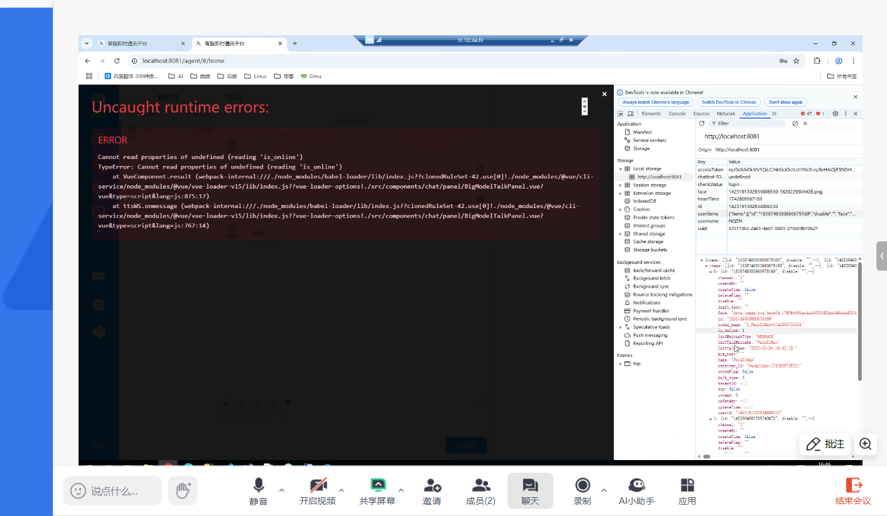

# 2025

## Todolist 

### 1. Token失效的处理（已修复）
**场景**：  
当 token 失效时，界面的上线和下线都无法操作。请核对 Server 给出的 token 失效是否有处理逻辑和应对，多谢。  
**优先级**：低  
**提出人**：TALU  

---



---

# 2024

## Todolist

### CR
1. **记录用户最后登录时间**  
    如果用户超期未登录，需要体现出来。

---

### 优化点 & Bug

#### 1. 如何触发转人工
**当前逻辑**：  
通过用户输入文字是否包含“转人工”触发。  
**问题场景**：  
如果用户转人工后，再次输入“我想知道转人工的工作时间”，由于包含“转人工”，系统会认定为转人工命令，仅提示用户，而未将“我想知道转人工的工作时间”发送给 SD。  
**优化建议**：  
以“转人工”开头的输入视为用户需要转人工。

---

#### 2. 特殊字符处理
**问题描述**：  
特殊字符的处理（不是升级导致的，放在后续集中修复）。  
**场景**：  
微信端，SDWQZY 在 11 月 05 日 15:29 给用户（XUYX）发送的消息，XUYX 未收到。具体发送内容如下：  
> "您的签到表 AMN-XUYX-241021-002182738 目前已经更新，张晓宁老师已经不标黄，请您务必通过智会系统点击同步 iwe 数据按钮同步确认（可以立刻操作）。请务必确保 iwe 结果合格在操作关会。另外如若会议被跟会，请务必等待返还结果为合格后再进行关会。如若已经被判定第三方跟会不合格，请将合格的签到表发送到 shensu@novonordisk.com 的邮箱中，请第三方团队帮您重新判定结果。"  
**附件**：用户聊天记录与 SD 聊天记录对比图。  
**请求**：辛苦帮忙查明是因为字数问题还是因为对话中包含了某些特殊字符，谢谢。

---

#### 3. 优化派单逻辑（待确认）
**建议**：  
优化 SD 坐席分配逻辑，汇总如下：  
- 假如 SD 有 3 人（A、B、C），每个坐席最多接待 3 个用户。  
- 当每个坐席接待量不满时，A、B、C 按顺序轮流安排。  
- 当坐席接待量满时，剩余接待量不满的 SD 按顺序轮流安排。

---

#### 4. 转人工的导出聊天日志
**问题描述**：  
导出转人工日志时无反应。  
**原因**：  
目前聊天日志数据量较大，需要性能优化。  
**报错信息**：  
```
Caused by: java.sql.SQLSyntaxErrorException: Expression #4 of SELECT list is not in GROUP BY clause and contains nonaggregated column 'm2.art_text' which is not functionally dependent on columns in GROUP BY clause; this is incompatible with sql_mode=only_full_group_by
```

---

#### 5. 微信端：SD 发送结束转人工，用户无法取消或退出转人工（偶尔出现，已完成）
**建议**：  
如果找不到原因，可以先放开此功能，仅提示用户即可，不强制用户操作。

---

#### 6. 微信端：消息错发问题（已完成）
**问题描述**：  
例如：在回复客户 1 时，客户 2 进线说话，导致发给客户 1 的消息自动发给客户 2。  
**建议**：  
需要内部测试验证，可能是之前的场景未覆盖到。如有问题或疑问，可联系 SD 一起查看。

---

#### 7. Teams 端：ZJQH 使用 Teams 报单时，SDWQZY 回复的内容接收不到（已完成）

---

#### 8. 转人工 Portal：SD 和用户聊天过程中，SD 退出当前会话或因网络原因退出 chat，左侧用户列表状态未及时更新

---

#### 9. SD 网络延迟或故障时的重新连接（已完成）

---

#### 10. 提供 SD 转接功能
**功能需求**：  
在 chat portal 中，SD 可以将用户转接到其他在线 SD。

---

#### 11. 提供 SD 和用户服务关系的可视化
**功能需求**：  
SD 可以知道当前用户在哪个 SD 那里，便于了解自己当前真实有效的用户。
